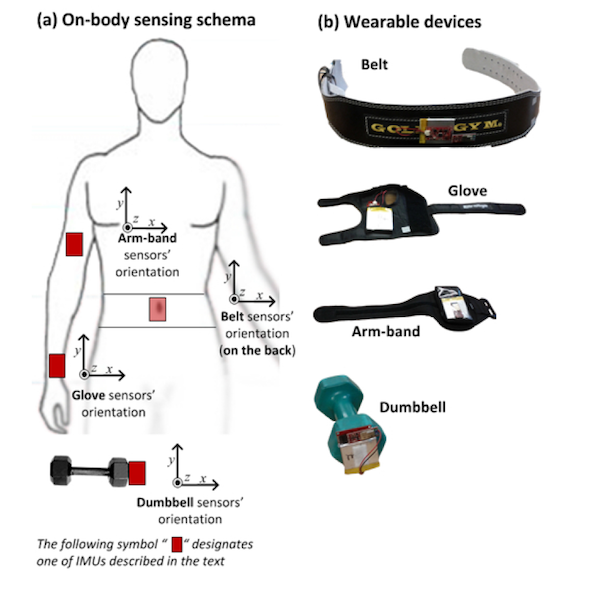
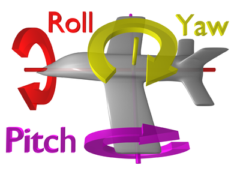

```{r setup, include=FALSE}
knitr::opts_chunk$set(echo = TRUE)
```

## Project Overview

The goal of this project is to use data from sensors on the belt, forearm,
arm, and dumbell of 6 participants to determine whether they are using proper 
form to lift a dumbell.

The Classe result feature has values A, B, C, D, and E.  Class A corresponds
to the correct execution of the exercise, while the other 4 classes
correspond to common mistakes.

Data was recorded using inertial measurement units (IMU), providing three-axes
acceleration, gyroscope and magnetometer data.  Each IMU also featured a Bluetooth
module that streamed the recorded data to a notebook lab computer. The sensors 
were mounted in the users’ glove, armband, lumbar belt and dumbbell 
(see left-hand figure), making the tracking system as unobtrusive as possible.

 

The right-hand figure illustrates the concepts of pitch, yaw, and roll, commonly used
in aviation, that are part of the output from the sensors.


Participants performed one set of 10 repetitions of the Unilateral Dumbbell 
Biceps Curl in each of five different manners: 

* Classe A - executed exactly as specified
* Classe B - elbows thrown to front
* Classe C - lifted only halfway
* Classe D - lowered only halfway
* Classe E - hips thrown to front

The original paper on which this project is based is available at:
[Qualitative Activity Recognition of Weight Lifting Exercises](http://groupware.les.inf.puc-rio.br/public/papers/2013.Velloso.QAR-WLE.pdf)


## Project approach

Two different machine learning models were created: a Random Forest model, and
a Support Vector Machine (SVM) model.  These machine learning algorithms were
selected because they are among the most popular and powerful for high dimension
classification problems.

To allow an apples to apples comparison of the models, each model was trained 
using the same training partition and validated using the same validation
data.  Each model was run against the project test set and the results compared
as well.

## Model Development and Evaluation

### Load required libraries

All the package libraries needed for the selected machine learning algorithms are first
loaded into the environment.

```{r load.libraries, include=FALSE}

# ipak function: install and load multiple R packages.
# check to see if packages are installed. Install them if they are not, then load them into the R session.

ipak <- function(pkg){
    new.pkg <- pkg[!(pkg %in% installed.packages()[, "Package"])]
    if (length(new.pkg)) 
        install.packages(new.pkg, dependencies = TRUE)
    sapply(pkg, require, character.only = TRUE)
}

# usage
packages <- c("ggplot2", "dplyr", "tidyr", "tibble", "caret", "randomForest",
              "neuralnet", "gbm", "e1071", "nnet", "devtools",
              "xtable", "knitr")
ipak(packages)
options(xtable.floating = FALSE)
options(xtable.timestamp = "")
options(xtable.comment = FALSE)

source_url('https://gist.githubusercontent.com/fawda123/7471137/raw/466c1474d0a505ff044412703516c34f1a4684a5/nnet_plot_update.r')


```

### Prepare Project Data

#### Read and clean project data

The project training and testing data sets should be downloaded from the source 
urls to the project directory and then read as .csv files into R.

* https://d396qusza40orc.cloudfront.net/predmachlearn/pml-training.csv
* https://d396qusza40orc.cloudfront.net/predmachlearn/pml-testing.csv

```{r getdata, cache=TRUE}
pmlTrain <- read.csv("./pml-training.csv")
pmlTest = read.csv("./pml-testing.csv")

```
The datasets contain 160 columns.  The training dataset has 19622 rows and the
test dataset has 20. The first 7 column attributes do not contain
sensor measures, so they will be excluded as predictors.  Column 160 is 
the target prediction variable, classe. Structural queries reveal that many 
columns are primarily NA's.   Also, some columns are integer and others numeric.

First, we'll drop the first 7 columns and coerce all columns to numeric, with 
the exception of the classe column, 160.

```{r make.numeric}
pmlTrain[,8:159] <-sapply(pmlTrain[,8:159], as.numeric)
pmlTest[,8:159] <-sapply(pmlTest[,8:159], as.numeric)

pmlTrain <- pmlTrain[,8:160]
pmlTest <- pmlTest[,8:160]

```

Next, we'll eliminate the NA columns.

```{r remove.nas}
# find NA columns  
nas = is.na(apply(pmlTest[,-160], 2, sum))  

# drop NA columns from both the training and test data sets
pmlTest <- pmlTest[, !nas]
pmlTrain <- pmlTrain[, !nas]

```
#### Parition train and validation datasets

The cleaned pmlTrain dataset was then partitioned into train and validation (val)
datasets.  Train was used in project training and val was used to estimate each
model's out of sample error.

```{r partition.data}

seed <- 415
set.seed(seed)

inTrain <- createDataPartition(y=pmlTrain$classe, p=0.7, list=FALSE);
train <- pmlTrain[inTrain,]
val <- pmlTrain[-inTrain,]

```

## Create and Evaluate Machine Learning Models


### Summary of model training feature set

52 predictor feature columns and the target variable Classe remain after 
dropping the columns that contained mostly missing data. The features
that remain are the integrated intertial measures of pitch, yaw, roll, and 
total acceleration, and the detailed three-axes data from the accelerometer, 
gyro, and magnetometer for each of the arm, glove, belt, and dumbell sensors.

The machine learning models will be built based on this feature set.

### Model I: Random Forest Model with Cross-Validation`

#### Build Random Forest model

Random Forest was selected as one the machine learning techniques becasuse it is
one of the most used and accurate machine learning algorithms. 

Random forest works by extending bagging to classification trees.  It is an 
ensemble model that works by growing a "forest" of many trees. Each tree is 
grown on a bootstrap sample, with replacement, of the full set of training data.
At each node, each tree selects a random subset of all the possible variables
from the training data.  It then finds the best split on the selected variables.
Predictions are based on a vote of all the final trees.

I set the ntree parameter to build 100 trees, and also set the importance
parameter to true in order to see which were most important to predicting classe.
I also chose to use 5-fold cross validation with the random forest model to 
minimize over-fitting.

```{r rf.model, cache=TRUE}
### randomforest with cross-validation

fit.ctrl <- trainControl(method="cv",number=5)
fit.rf <- train(classe ~ ., data=train, method="rf",prox=T,
                     importance=TRUE, ntree=100, trainControl=fit.ctrl)

```

#### Evaluate Random Forest model

```{r evaluate.rf.model} 
# print model results  

print(fit.rf)  

# print final model results  

print(fit.rf$finalModel)  

# print the plot showing the number of trees used in the final model  

plot(fit.rf$finalModel)  


```  

The first plot shows that there was a rapid diminishing degree of accuracy as 
the number of trees exceeded 40. 

```{r variable.importance}

# show the plot of decreasing variable importance

plot(fit.rf)


```  

The model ended up using 27 of the available 52 features as predictors based
on the highest value for accuracy.


##### Expected Out of Sample Error  

```{r confusion.rf}

# Evaluate the model against new data using the validation dataset, val.
# Print a confusion matrix to show the accuracy of the val classe predictions.

p.val <- predict(fit.rf, val)
confusion.val.rf <- confusionMatrix(val$classe, p.val)
confusion.val.rf  


```


Out of sample error for the random forest model was estimated by applying the
prediction algorithm to new data using the validation data set val. The confusion
matrix of the actual classe value for each sample row and the predicted value 
showed an overall accuracy of 0.9932 with a 95% Confidence Interval (CI).


The following plot shows that the random forest model had excellent sensitivity
and selectivity for the 5 values of classe.  


```{r rf.plots, results="asis", echo=FALSE}


plot(confusion.val.rf$byClass, main="random forest")
text(confusion.val.rf$byClass[,1]+0.001, confusion.val.rf$byClass[,2],
        labels = LETTERS[1:5], cex = 0.8)

```
  
#### Predictor Importance    

This table compares the top 5 predictors for each of classe, A to E.   It is 
interesting to take classe A, entirely correct execution, as a benchmark. All but
one of four incorrect forms agree with A on the most important predictor, 
roll_belt. For predictor 2, only 2 of 4 agree.  For predictors 3 and 4, none agree.
All classes agree that total_accel_belt is the fifth most important predictor.
Also noteworthy is that all the classes use the same set of 5 predictor features
that classe A uses, but each with a  distinct order of importance.  This 
suggests that these are really the best set of differentiators among the five 
classes of performing the biceps curl.

```{r predictor.rank, results="asis", echo=FALSE }

## obtain the ranked importance of the  predictors based on the
## randomforest model
library(tibble)
var.imp <- varImp(fit.rf)
pred.rank <- var.imp$importance
pred.rank <- rownames_to_column(pred.rank, var = "feature")

# Classe A top 5 predictors

pred.rank.A <- pred.rank %>% select(feature, A)  %>% slice(1:5) %>% 
        mutate(classe = "A") %>% rename(feature.importance = A) 
pred.rank.A <- arrange(pred.rank.A, desc(feature.importance))
pred.rank.A <- pred.rank.A %>% mutate(rank = dense_rank(desc(feature.importance)))
pred.rank.A <- select(pred.rank.A, -feature.importance)

# Classe  B top 5 predictors

pred.rank.B <- pred.rank %>% select(feature, B)  %>% slice(1:5) %>% 
        mutate(classe = "B") %>% rename(feature.importance = B) 
pred.rank.B <- arrange(pred.rank.B, desc(feature.importance))
pred.rank.B <- pred.rank.B %>% mutate(rank = dense_rank(desc(feature.importance)))
pred.rank.B <- select(pred.rank.B, -feature.importance)

# Classe  C top 5 predictors

pred.rank.C <- pred.rank %>% select(feature, C)  %>% slice(1:5) %>% 
        mutate(classe = "C") %>% rename(feature.importance = C) 
pred.rank.C <- arrange(pred.rank.C, desc(feature.importance))
pred.rank.C <- pred.rank.C %>% mutate(rank = dense_rank(desc(feature.importance)))
pred.rank.C <- select(pred.rank.C, -feature.importance)


# Classe  D top 5 predictors

pred.rank.D <- pred.rank %>% select(feature, D)  %>% slice(1:5) %>% 
        mutate(classe = "D") %>% rename(feature.importance = D) 
pred.rank.D <- arrange(pred.rank.D, desc(feature.importance))
pred.rank.D <- pred.rank.D %>% mutate(rank = dense_rank(desc(feature.importance)))
pred.rank.D <- select(pred.rank.D, -feature.importance)

# Classe  E top 5 predictors

pred.rank.E <- pred.rank %>% select(feature, E)  %>% slice(1:5) %>% 
        mutate(classe = "E") %>% rename(feature.importance = E) 
pred.rank.E <- arrange(pred.rank.E, desc(feature.importance))
pred.rank.E <- pred.rank.E %>% mutate(rank = dense_rank(desc(feature.importance)))
pred.rank.E <- select(pred.rank.E, -feature.importance)

spread.A <- xtable(pred.rank.A %>% spread(rank, feature), auto = TRUE)
spread.B <- xtable(pred.rank.B %>% spread(rank, feature), auto = TRUE)
spread.C <- xtable(pred.rank.C %>% spread(rank, feature), auto = TRUE)
spread.D <- xtable(pred.rank.D %>% spread(rank, feature), auto = TRUE)
spread.E <- xtable(pred.rank.E %>% spread(rank, feature), auto = TRUE)

## do a bind_rows to add result for each classe to full set


classe.ranks <- kable(bind_rows(spread.A, spread.B, spread.C,
         spread.D, spread.E ), caption="Top 5 Predictors by Classe", auto=TRUE)

print(classe.ranks, type="html", include.rownames=FALSE)

```

****  
 
### Model II: Classification Support Vector Machine (SVM)
 
 
#### Build SVM model

Support Vector Machines (SVM) provide a powerful technique for general 
classification.  SVMs were originally developed for binary classification, where
sample data falls into two distinct classes. In the multidimensional space defined
by the feature variables, the SVM looks for the optimal separating hyperplane
between the two classes by maximizing the margin between the classes' closest
points.  The points lying on the boundaries are called support vectors, and the
middle of the margin is the optimal separating hyperplane.


Our model must deal with a multi-class classification of the set of 5 classe 
variables A to E.  While SVMs bsically are designed for binary clasification
problems, they can deal with this problem by fitting all binary subclassifiers
and then voting to determine the correct class.

When the data is nonlinear and there is no linear separator, the data points 
are projected onto a higher-dimensional space by what is called a kernal, where
the data points effectively become linearly separable.  

[see "Support Vector Machines" by David Meyer]
(https://cran.r-project.org/web/packages/e1071/vignettes/svmdoc.pdf)


##### SVM Parameter Selection

The SVM model uses the default Radial kernal.  It has two parameters which
determine the accuracy of the resulting SVM model.  The first is gamma, and the
second is cost.

I used tune.svm to find the optimal values for gamma and cost. tune.svm performs
a grid search over all parameters in the specified ranges, and returns the best
performing values based on accuracy. I did two rounds of tune.svm, using the first
round to narrow in on the optimal range, and the second to find the best paramater
values for gamma and cost. The final values were gamma=0.06, and cost=256.  

The cross parameter was set to 10, which specified using 10-fold cross validation.


```{r svm.model, cache=TRUE}

set.seed(seed)

# obj <- tune.svm(classe ~ ., data=train,
#       gamma = 2^(-2:2), cost = 2^(2:4))

# obj.2 <- tune.svm(classe ~ ., data=train,
#       gamma = seq(0.01,0.5, by= 0.05), cost = 2^(2:8))


fit.svm <- svm(classe ~ ., data=train,
            cost=256, gamma=0.06, cross=10)

```

#### Evaluate SVM model

```{r review.SVM}

print(fit.svm)

print(fit.svm$tot.accuracy)

```
The svm modeled created 5083 support vectors and achieved an overall accuracy 
of 0.9943 against the training data.


##### Expected Out of Sample Error  

```{r confusion.svm}


svm.predict.val <- predict(fit.svm, val[-53])
confusion.svm.val <- confusionMatrix(val$classe, svm.predict.val)
confusion.svm.val

```

Out of sample error for the svm was estimated by applying the
prediction algorithm to new data using the validation data set. The confusion
matrix of the actual classe value for each sample row and the predicted value 
showed an overall accuracy of 0.9956 with a 95% Confidence Interval (CI).

The following plot shows that the svm model also had excellent sensitivity
and selectivity for the 5 values of classe.  


```{r svm.plots, results="asis", echo=FALSE}


plot(confusion.svm.val$byClass, main="support vector machine")
text(confusion.svm.val$byClass[,1]+0.001, confusion.svm.val$byClass[,2],
        labels = LETTERS[1:5], cex = 0.8)

```  

#### Predictor Importance    

Unlike the random forest model, the svm does not rank the importance of the model
predictors.  


## Project Summary - Random Forest vs. SVM

Both the random forest and the svm models were extremely accurate. The random 
forest model had an overall out of sample accuracy of 0.9932, while the svm
model had an overall out of sample accuracy of 0.9956, both with a 95% 
Confidence Interval (CI).

Both models had excellent sensitivity and selectivity for the different classes,
each in the range of 0.99.

Both models also correctly predicted 20 out of 20 of the project test cases.

The random forest and svm models were chosen for the project because of their 
strength in handling large multi-class classification problems.  They appear to
heve been equally effective in this project.

